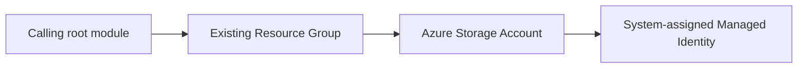

# Terraform Module for Azure Storage Account

Provisions an [Azure Storage Account](https://registry.terraform.io/providers/hashicorp/azurerm/latest/docs/resources/storage_account)
with TLS 1.2 enforced, public blob access disabled, and a system-assigned
managed identity. The caller owns the resource group, provider configuration,
backend, and Terraform state.

## Dependency Graph



## Usage

```hcl
module "storage" {
  source               = "git::https://github.com/f2calv/tf_module_azurerm_storage_account.git//src?ref=0.2.1"
  resource_group_name  = azurerm_resource_group.rg.name
  location             = azurerm_resource_group.rg.location
  storage_account_name = "mystorageaccount"
  tags                 = { environment = "dev" }
}
```

The resource group in this example is created by the calling root module and is
not managed by this module.

<!-- markdownlint-disable MD060 -->
<!-- BEGIN_TF_DOCS -->
## Requirements

| Name | Version |
| ---- | ------- |
| terraform | >= 1.0 |
| azurerm | >= 5.0, < 6.0 |

## Providers

| Name | Version |
| ---- | ------- |
| azurerm | >= 5.0, < 6.0 |

## Resources

| Name | Type |
| ---- | ---- |
| [azurerm_storage_account.this](https://registry.terraform.io/providers/hashicorp/azurerm/latest/docs/resources/storage_account) | resource |

## Inputs

| Name | Description | Type | Default | Required |
| ---- | ----------- | ---- | ------- | :------: |
| resource\_group\_name | Name of the parent resource group. | `string` | n/a | yes |
| storage\_account\_name | Name of the storage account. | `string` | n/a | yes |
| access\_tier | Storage account access tier (Hot or Cool). | `string` | `"Hot"` | no |
| account\_kind | Storage account kind (StorageV2, BlobStorage, etc.). | `string` | `"StorageV2"` | no |
| account\_replication\_type | Storage account replication type (LRS, GRS, RAGRS, ZRS). | `string` | `"LRS"` | no |
| account\_tier | Storage account tier (Standard or Premium). | `string` | `"Standard"` | no |
| location | Location of the parent resource group. | `string` | `"West Europe"` | no |
| tags | Any tags that should be present on the resources. | `map(string)` | `{}` | no |

## Outputs

| Name | Description |
| ---- | ----------- |
| id | The ID of the storage account. |
| location | The location of the storage account. |
| name | The name of the storage account. |
| primary\_access\_key | The primary access key for the storage account. |
| primary\_connection\_string | The primary connection string for the storage account. |
<!-- END_TF_DOCS -->
<!-- markdownlint-enable MD060 -->

## Development

Regenerate the Terraform reference after changing resources, variables,
outputs, or version constraints:

```bash
terraform-docs --config .terraform-docs.yml src
```

The pre-commit configuration runs the same command in CI and fails when
generated documentation is not committed.
